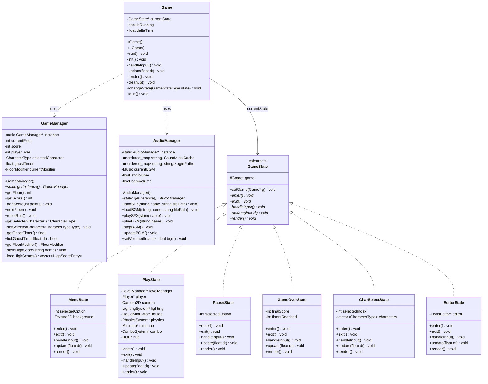
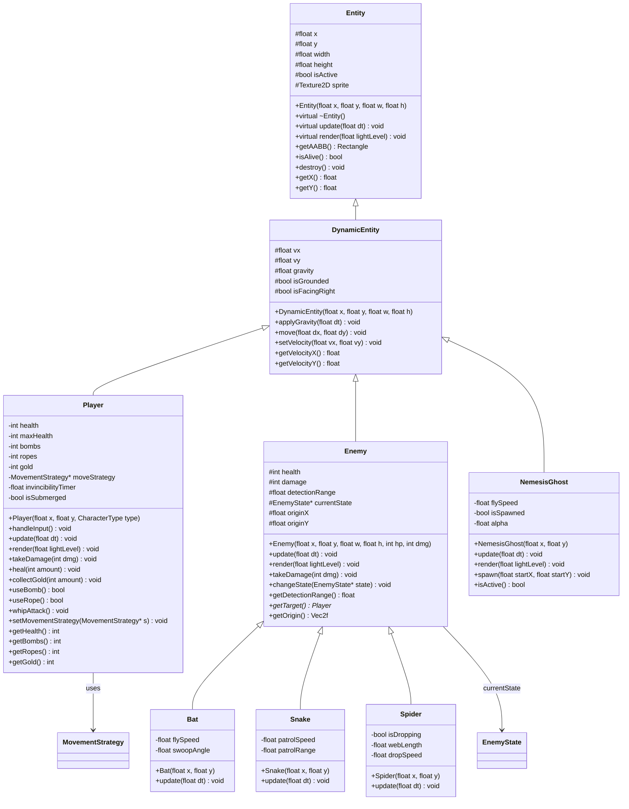
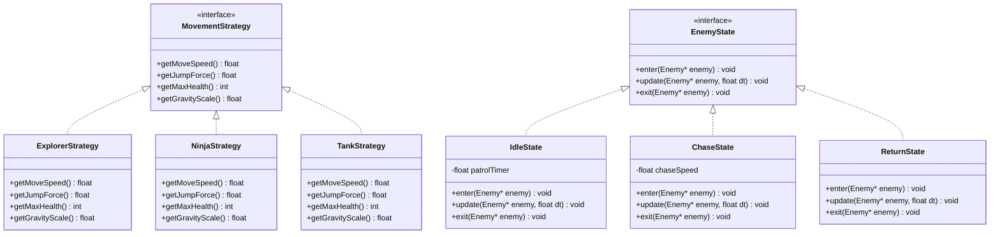
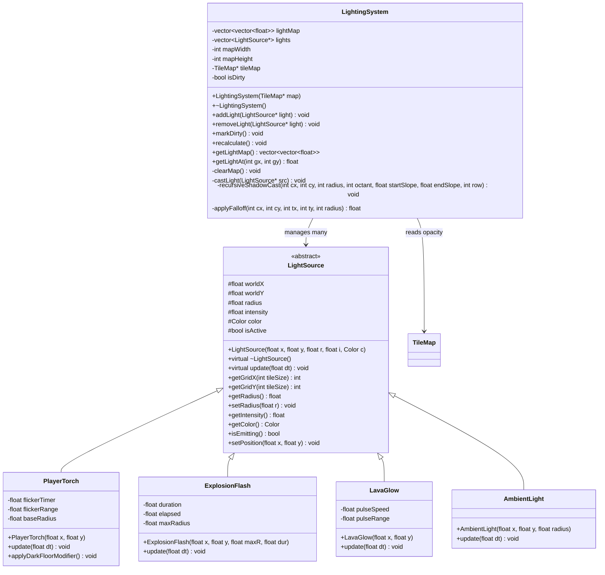
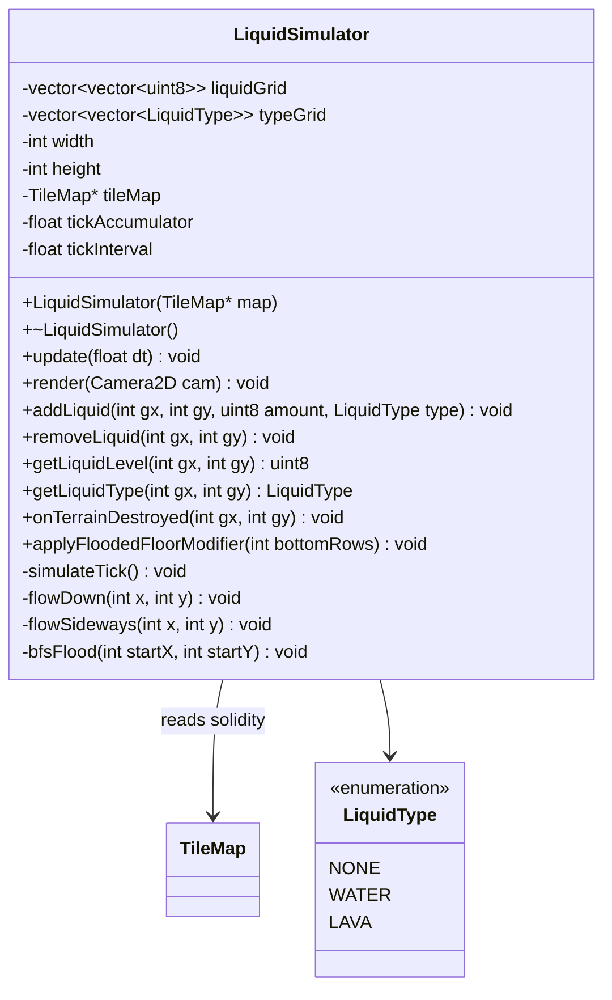
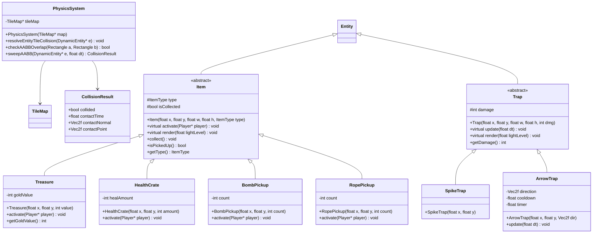
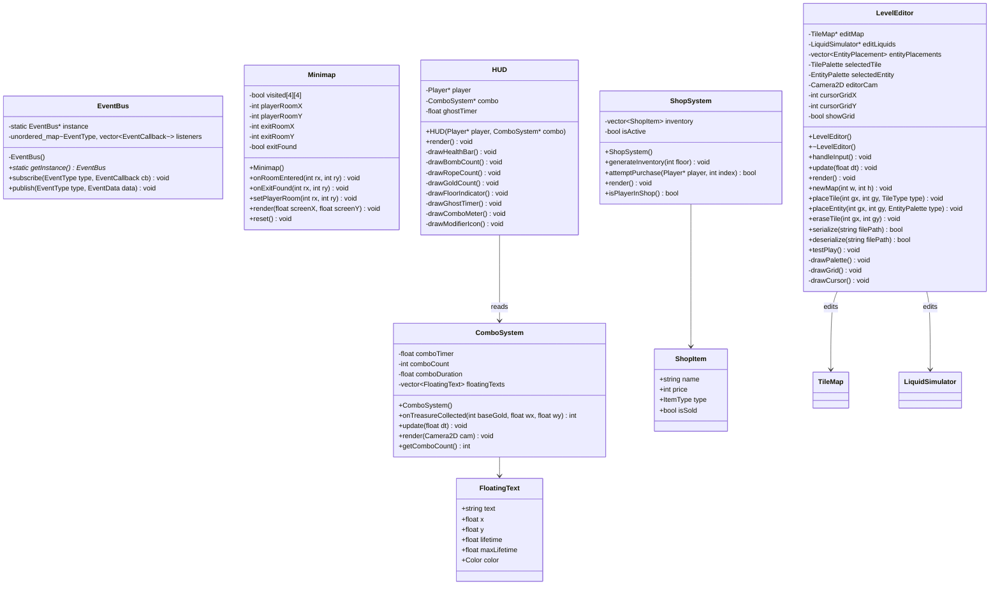

# CS202 Final Project — Game Design Document
## *Cavern Descent*: A Spelunky-Inspired 2D Roguelike Platformer

> [!NOTE]
> **Team Size:** 2 students (requires 2× features = 24 total for maximum score).
> **Tech Stack:** C++17, Raylib 5.x, custom AABB physics (no Box2D).
> **Assets:** Original Spelunky visual & audio assets (educational, non-commercial use).
> **Grading:** Each advanced feature is scored 0.25–0.5 pts based on execution quality. Strategy: maximize visual impact per hour of dev time.

---

## 1. Feature Justification Table (Max Grade Focus)

The CS202 rubric scores the standard 4-person Mario project across three tiers:

| Tier | Points | What it covers |
|---|---|---|
| Functionality | 65 | Movement, Collision, Enemies, Items, 3 Levels, Sound |
| Design & Implementation | 35 | OOP Design (10), 5 Design Patterns (25) |
| Additional Requirements (Advanced) | 15 | Enemy AI (5), Multiple Characters (5), 3D Game (5) |

As a group of 2, we deliver **12 standard features** (Functionality + Design) plus **12 advanced features** (rubric Advanced tier + our original features) = **24 total**.

### Standard 12 Features (Functionality + Design = 100 pts)

These cover every item in the base **Functionality** and **Design & Implementation** tiers. No advanced/bonus items here.

| # | Rubric Category | Mario Baseline | Our Equivalent | Pts |
|---|---|---|---|---|
| 1 | Player Movement | Walk, run, jump | WASD platformer physics, gravity, variable-height jump | 20 |
| 2 | Collision Detection | Mario ↔ blocks/pipes | Custom AABB tile + entity collision with push-out resolution | (incl.) |
| 3 | Enemy Behavior | Goombas/Koopas patrol | 3 types with basic patrol: Bat (fly), Snake (walk), Spider (hang) | 10 |
| 4 | Power-Ups & Items | Mushroom, Fire Flower, Coin | Bombs, Ropes, Health Crate, Treasure (gold/gems) | 10 |
| 5 | Level 1 | World 1 | Procedural Cave zone (floors 1–3) | 15 |
| 6 | Level 2 | World 2 | Procedural Jungle zone (floors 4–6) | (incl.) |
| 7 | Level 3 | World 3 | Procedural Temple zone (floors 7–9) | (incl.) |
| 8 | Sound Effects & Music | Jump SFX, level BGM | SFX (jump, collect, bomb, damage, death) + 3 zone BGMs | 10 |
| 9 | OOP Design | Inheritance, polymorphism | Entity hierarchy, typed ownership, RAII smart pointers | 10 |
| 10 | 5 Design Patterns | Factory, Singleton, etc. | Factory, Singleton, State, Strategy, Observer | 25 |
| 11 | Block Destruction | Break bricks / hit ? blocks | Whip-attack to break single cracked blocks, revealing items | — |
| 12 | Score & Lives HUD | Score, coins, lives display | HUD bar: health, bombs, ropes, gold, floor number, combo meter | — |

### 12 Advanced Features (2× Requirement)

**A1–A2** map to the rubric's "Additional Requirements" tier. **A3–A12** are our original additions. Features marked 🎬 are specifically chosen for **high demo-video visual impact with low code effort**.

| # | Advanced Feature | Core Technique | Complexity | Visual |
|---|---|---|---|---|
| A1 | **Multiple Playable Characters** | Strategy pattern: distinct physics per character | Medium | 3 characters with unique feel |
| A2 | **Enemy Proximity AI (State Machine)** | `EnemyState` interface: Idle → Chase → Return | Medium | Enemies react to player |
| A3 | **🎬 Minimap with Fog of War** | 4×4 room grid overlay; rooms revealed on entry; exit marker | **Low** | **Always-visible exploration tracker in HUD corner** |
| A4 | **Procedural Level Generation (Graph)** | Adjacency-list graph + DFS golden path + BFS validation + per-floor difficulty scaling | **High** | Every run is unique |
| A5 | **Destructible Terrain (Bomb System)** | Runtime tile-grid mutation, 3×3 blast radius, cascading effects on liquid + lighting | Medium | Bombs blow open walls |
| A6 | **🔦 Dynamic Lighting & Shadow Casting** | Recursive 8-octant shadowcasting algorithm | **High** | **Dark caves with real-time torch shadows** |
| A7 | **🌊 Liquid Physics Simulation (CA)** | Cellular automata flow rules + BFS flood propagation | **High** | **Water/lava flows and floods** |
| A8 | **🛠️ Full In-Game Level Editor** | Tile palette, grid placement, `.lvl` file serialize/deserialize | **High** | **Players design custom levels (Bonus feature)** |
| A9 | **🎬 The Nemesis Ghost** | Timer-triggered entity: passes through walls, flies directly toward player coordinates | **Low** | **Terrifying time-limit enforcer** |
| A10 | **🎬 Level Environmental Modifiers** | Random floor affixes: "Dark Floor" (reduced torch), "Flooded Floor" (water-filled bottom rows) | **Low** | **Each floor feels different** |
| A11 | **🎬 Treasure Combo Multiplier** | 3-second decay timer + multiplier counter + floating text rendering | **Low** | **Satisfying on-screen combo feedback** |
| A12 | **Shop System** | Dynamic pricing, item inventory, transaction logic | Medium | In-cave shops with upgrades |

> [!IMPORTANT]
> **Total: 12 standard + 12 advanced = 24 features.** High-algorithm features (A4, A6, A7) prove technical depth. High-visual/low-effort features (A3, A9, A10, A11) maximize demo impact without burning dev time. A8 (Level Editor) maps to the rubric's explicit "Bonus Feature." No feature in the advanced list duplicates a standard item.

---

## 2. Core Game Loop & Mechanics

### 2.1 Permadeath Loop

```text
MAIN MENU → Select Character → Generate Floor 1
  ↓
GAMEPLAY LOOP:
  Explore dark caves with torch light
  → Collect Treasure (combo multiplier ticking!)
  → Avoid/Fight Enemies & Traps
  → Navigate water/lava
  → Find Exit before Ghost spawns!
  → Descend to Next Floor (difficulty ↑, maybe a floor modifier!)
  ↓
DEATH → Game Over Screen → Show Score → Return to MAIN MENU
```

### 2.2 Procedural Generation (Graph Algorithm) + Difficulty Scaling

Each floor is a **4×4 macro-grid** of 16 room slots:

```text
[R00] [R01] [R02] [R03]      ← Player spawns in a top-row room
[R04] [R05] [R06] [R07]
[R08] [R09] [R10] [R11]
[R12] [R13] [R14] [R15]      ← Exit placed in a bottom-row room
```

**Algorithm — Golden Path Generation:**

1. **Macro Grid Walk:** Model the 4×4 grid as a 2D array (`RoomRole macroGrid[4][4]`). Start at a random top-row cell.
2. **Random Walk:** Loop until reaching the bottom row: 80% chance to move left/right, 20% chance to drop down. Edges force a drop down. The traversed cells form the **Golden Path**.
3. **BFS Validation:** After room population, BFS from spawn to exit on the tile grid confirms reachability with platformer physics constraints (jump height, gravity).
4. **Room Template Instantiation:** Golden-path rooms load `.txt` templates via Factory. Off-path rooms are loaded as side rooms. Spelunky templates naturally have open walls, so no carving pass is needed.

**Integrated Difficulty Scaling (per floor):**

`LevelGenerator::generate()` scales parameters via a `DifficultyConfig` lookup:

```text
Floor  | Enemies/Room | Trap Density | Treasure Value | Enemy Speed | Ghost Timer
-------|-------------|-------------|----------------|-------------|------------
 1–3   |     1       |    Low      |     Low        |    1.0×     |   180s
 4–6   |     2       |   Medium    |    Medium      |    1.2×     |   150s
 7–9   |     3       |    High     |     High       |    1.5×     |   120s
```

**Data Structures:**
- `RoomRole macroGrid[4][4]` — 2D array tracking room roles.
- `std::vector<std::vector<char>>` — room template grids from `.txt` files.
- `std::queue<int>` — BFS validation queue.

### 2.3 Block Destruction (Standard) vs. Bomb Destruction (Advanced)

**Standard — Whip/Attack (S11):** Player whips single `TileType::CRACKED` blocks to break them and reveal items. One tile at a time. Mario-equivalent brick breaking.

**Advanced — Bomb Area Destruction (A5):** Bombs detonate with a **3×3 blast radius**, clearing all solid tiles. Cascading effects:
- Liquid floods into newly opened space (A7 system notified).
- Lighting recalculates for changed tile opacity (A6 system notified).
- Both triggered via Observer pattern (EventBus).

### 2.4 Dynamic Lighting & Shadow Casting (A6)

The cave is **dark by default**. The player carries a torch that casts light. Walls block light, creating real-time shadows.

**Algorithm — Recursive Shadowcasting (8-octant):**

```text
For each of 8 octants around the light source:
  1. Scan outward row-by-row from origin
  2. Check each cell for wall (opaque)
  3. Wall found → narrow scan's start/end slope to create shadow
  4. Transparent cell after wall → recurse with remaining arc
  5. Light intensity = inverse-square falloff by distance
```

**Light Sources:**
- **Player torch:** Primary light. Radius affected by "Dark Floor" modifier (A10).
- **Bomb flash:** Brief, intense, wide-radius burst.
- **Lava glow:** Lava tiles emit dim, warm, constant light.
- **Shop lantern:** Ambient warm light in shop rooms.

All sources additively blended into a 2D float grid → `ColorTint(tileColor, lightLevel)` in Raylib.

### 2.5 Liquid Physics Simulation (A7)

Water and lava simulated as a **cellular automaton** overlaying the tile map.

**CA Flow Rules (per tick, bottom-to-top):**

```text
For each liquid cell:
  1. Cell below empty → flow DOWN (transfer level)
  2. Below full       → flow LEFT and RIGHT equally
  3. Level per cell = uint8 (0–255) for smooth sub-tile flow
  4. Render as translucent colored rectangle (height ∝ level)
```

**Interactions:**
- **Bomb + Wall → Flood:** BFS propagation into newly empty space.
- **Water:** Slows player by 50%. Drowns enemies at depth threshold.
- **Lava:** Continuous damage. Emits light into lighting system.

### 2.6 The Nemesis Ghost (A9)

Each floor has a **countdown timer** (e.g., 180 seconds on floor 1, decreasing per floor). When the timer reaches zero:

1. A ghost entity spawns at a random map edge.
2. It **passes through all walls** (ignores tile collision entirely).
3. It **flies directly toward the player's position** every frame.
4. Contact is **instant death**.
5. It has a ghostly semi-transparent render with a trailing particle effect.

```cpp
// Extremely simple update logic:
void NemesisGhost::update(float dt) {
    float dx = player->getX() - x;
    float dy = player->getY() - y;
    float dist = std::sqrt(dx * dx + dy * dy);
    if (dist > 0.01f) {
        vx = (dx / dist) * flySpeed;
        vy = (dy / dist) * flySpeed;
    }
    x += vx * dt;
    y += vy * dt;
    // NO tile collision resolution — ghost passes through everything
}
```

> [!TIP]
> This is the Spelunky "Ghost" mechanic. Extremely high visual drama for ~30 lines of code. Encourages fast play and creates tense demo moments.

### 2.7 Level Environmental Modifiers (A10)

When generating a floor, the `LevelGenerator` rolls a random **floor modifier** (30% chance per floor, never on floor 1):

| Modifier | Effect | Implementation |
|---|---|---|
| **Dark Floor** | Player torch radius reduced by 50% | Set `playerTorch->setRadius(baseRadius * 0.5f)` |
| **Flooded Floor** | Bottom 2 tile rows pre-filled with water | `liquidSim->addLiquid(x, bottomRows, 255, WATER)` in generation |
| **Cursed Floor** | All treasure values doubled, but ghost timer halved | Modify `DifficultyConfig` fields |

Applied as a `FloorModifier` enum stored in `LevelManager`. Each modifier tweaks an existing system's parameter — no new systems needed.

### 2.8 Minimap with Fog of War (A3)

A small **4×4 grid overlay** rendered in a corner of the HUD, representing the 16 room slots of the current floor. Rooms start blacked out (fog of war) and are revealed as the player enters them.

```text
[?] [?] [?] [?]       [██] [  ] [??] [??]
[?] [?] [?] [?]  →    [██] [🔦] [??] [??]    (🔦 = player's current room)
[?] [?] [?] [?]       [??] [??] [??] [??]
[?] [?] [?] [?]       [??] [??] [🚪] [??]    (🚪 = exit, shown once found)
```

**Implementation (~50 lines):**
- `bool visited[4][4]` — set to `true` when player enters a room.
- Current room highlighted with player icon.
- Exit room marked once the player discovers it.
- Golden-path rooms could be tinted differently for subtle guidance.
- Rendered as small colored rectangles in the HUD layer (outside `BeginMode2D`).

> [!TIP]
> A staple of the roguelike genre. Always visible on screen during gameplay — great for the demo video. Enhances exploration strategy with almost zero code.

### 2.9 Treasure Combo Multiplier (A11)

When the player collects a treasure:
1. A **combo timer** (3 seconds) starts or resets.
2. The **combo counter** increments (×2, ×3, ×4...).
3. Gold gained = `baseValue × comboMultiplier`.
4. A **floating text** (e.g., "+50 ×3!") rises from the treasure position and fades out.
5. If the timer expires without another pickup, the combo resets to ×1.

```cpp
int ComboSystem::onTreasureCollected(int baseGold, float worldX, float worldY) {
    comboTimer = COMBO_DURATION; // reset 3-second timer
    comboCount++;
    int multiplied = baseGold * comboCount;
    spawnFloatingText("+" + std::to_string(multiplied) + " x" +
                      std::to_string(comboCount) + "!",
                      worldX, worldY, GOLD);
    return multiplied;
}
```

> [!TIP]
> Very high "game juice" for ~50 lines of code. The floating text and multiplier number create satisfying visual feedback in the demo video.

### 2.10 Enemy AI — State Machine (A2)

Enemies use a simple state machine with direct movement — no pathfinding needed.

- **IdleState:** Patrol a small area (bat drifts, snake walks back and forth, spider hangs). Transition to Chase if player enters detection radius.
- **ChaseState:** Move directly toward player's X-position. Bats fly toward player. Snakes walk toward player, turn at ledges/walls. Spiders drop when player is below.
- **ReturnState:** If player leaves detection range, return to original patrol position.

### 2.11 Autotiling & Chunking (Visual Polish)

To maximize visual impact (similar to Spelunky's organic caves), `TileMap` employs seamless texturing and border decals:
1. **Chunking (Seamless Texture):** A large 4×4 dirt texture is tiled seamlessly across the grid using `(x % 4)` and `(y % 4)` coordinate mapping.
2. **Border Decals (Autotiling):** `LevelGenerator::generateBorders()` scans the generated grid and calculates a 4-bit bitmask (Top, Right, Bottom, Left) for every `WALL` tile exposed to air. `TileMap::render()` uses this mask to draw edge details (rocky ground tops, stalactites) layered over the seamless dirt.

---

## 3. Design Patterns Integration

Exactly **5 design patterns**, each mapped to a concrete system:

| Pattern | System | Implementation |
|---|---|---|
| **Singleton** | `GameManager` | Global game state (floor, score, lives). `GameManager::getInstance()`. Also `AudioManager`, `EventBus`. |
| **Factory** | `EntityFactory` | Parses room `.txt` templates: char codes (`'1'`→Wall, `'E'`→Enemy, `'T'`→Treasure, `'W'`→Water) → concrete subclass constructors. |
| **State** | Enemy AI & Game Screens | Enemies: `EnemyState` → Idle/Chase/Return. Game: `GameState` → Menu/CharSelect/Play/Pause/GameOver/Editor. |
| **Strategy** | Character Movement | `MovementStrategy` → Explorer (balanced), Ninja (high jump, fast), Tank (slow, high HP). Swapped at character select. |
| **Observer** | Event System | `EventBus::subscribe/publish`. Events: bomb → terrain+lighting+liquid+audio; treasure pickup → combo system; ghost timer → spawn ghost. |

### Pattern Interaction Example

```text
Player throws a Bomb at a wall holding back water
  → Timer expires → Observer publishes EVENT_BOMB_EXPLODE
  → TerrainSystem destroys 3×3 tiles
  → LightingSystem creates ExplosionFlash
  → LiquidSimulator runs BFS flood-fill
  → AudioManager plays explosion SFX
  → Meanwhile, combo timer is ticking...
  → Player grabs treasure near the blast → ComboSystem: "×2!"
  → Ghost timer hits zero → Observer publishes EVENT_GHOST_SPAWN
  → NemesisGhost spawns, chasing through flooded cave!
```

---

## 4. Architecture & Modular Class Diagrams

### 4.1 Core Engine Subsystem



#### Method Behavior Descriptions — Core Engine

**Game**

| Method | Behavior |
|---|---|
| `run()` | Main entry point. Calls `init()`, then enters the main `while (!WindowShouldClose())` loop calling `handleInput()`, `update(dt)`, `render()` each frame. Calls `cleanup()` on exit. |
| `init()` | Initializes Raylib window (`InitWindow`), sets target FPS to 60, initializes `GameManager` and `AudioManager` singletons, loads all shared textures and sounds, creates the initial `MenuState`, calls `setGame(this)` and `enter()` on the initial state. |
| `handleInput()` | Delegates to `currentState->handleInput()`. No game-level input processing — all input is state-specific. |
| `update(float dt)` | Passes `GetFrameTime()` delta to `currentState->update(dt)`. Checks for pending state transitions queued by `changeState()`. |
| `render()` | Calls `BeginDrawing()`, `ClearBackground(BLACK)`, delegates to `currentState->render()`, then `EndDrawing()`. |
| `changeState(GameStateType state)` | Calls `currentState->exit()`, deletes old state, creates a new state based on the `GameStateType` enum via a switch statement, calls `setGame(this)` and `enter()` on the new state. Ensures clean resource handoff between states. |
| `cleanup()` | Deletes current `GameState`, calls `CloseAudioDevice()`, unloads all textures via Raylib, calls `CloseWindow()`. |

**GameManager (Singleton)**

| Method | Behavior |
|---|---|
| `getInstance()` | Returns the single static instance. Creates it on first call (lazy initialization). Thread-safe not required (single-threaded game). |
| `addScore(int points)` | Adds `points` to the running `score` total. Called when enemies are killed or treasure is collected. |
| `nextFloor()` | Increments `currentFloor` by 1. Determines `ZoneType` from floor number (1–3=Cave, 4–6=Jungle, 7–9=Temple). Resets `ghostTimer` to the new floor's timer value from `DifficultyConfig`. |
| `resetRun()` | Resets all run state to defaults: `currentFloor=1`, `score=0`, `playerLives=3`, `ghostTimer=180`. Called on permadeath before starting a new run. |
| `tickGhostTimer(float dt)` | Decrements `ghostTimer` by `dt`. Returns `true` when timer reaches zero (signals ghost spawn). Timer stops decrementing once ghost is active. |
| `saveHighScore(string name)` | Opens `highscores.sav` via `std::ofstream` (append mode). Writes `name,score,floorsReached` as a CSV line. Closes file. |
| `loadHighScores()` | Opens `highscores.sav` via `std::ifstream`. Parses each CSV line into a `HighScoreEntry` struct. Returns `vector<HighScoreEntry>` sorted by score descending. Returns empty vector if file doesn't exist. |

**AudioManager (Singleton)**

| Method | Behavior |
|---|---|
| `playSFX(string name)` | Looks up `name` in `sfxCache` (`unordered_map`). If found, calls Raylib `PlaySound(sfxCache[name])`. If not found, logs a warning and returns silently. |
| `playBGM(string name)` | Stops any currently playing music via `StopMusicStream()`. Loads the new music file, calls `PlayMusicStream()`. Sets `currentBGM` to the new stream. |
| `stopBGM()` | Calls `StopMusicStream(currentBGM)`. Used when transitioning to states that have no music (e.g., `PauseState`). |
| `setVolume(float sfx, float bgm)` | Clamps both values to [0.0, 1.0]. Sets `sfxVolume` and `bgmVolume`. Calls `SetMusicVolume(currentBGM, bgmVolume)` immediately. SFX volume is applied per-play. |

**GameState Abstract Class & Concrete States**

> Each `GameState` holds a `Game* game` back-pointer, set via `setGame()` when the state is created by `Game::changeState()`. Concrete states call `game->changeState(GameStateType)` to request transitions — they do not manage the transition themselves. All methods (`enter`, `exit`, `handleInput`, `update`, `render`) are pure virtual (`= 0`).

| Method | Behavior (varies per state) |
|---|---|
| `GameState::setGame(Game* g)` | Stores the owning `Game` pointer. Called by `Game::changeState()` and `Game::init()` immediately after creating a new state. |
| `MenuState::enter()` | Loads menu background texture. Starts menu BGM via `AudioManager`. Sets `selectedOption = 0`. |
| `MenuState::handleInput()` | Up/Down arrows change `selectedOption` (0=Start, 1=Editor, 2=Quit). Enter key triggers: 0→`game->changeState(GameStateType::CHAR_SELECT)`, 1→`game->changeState(GameStateType::EDITOR)`, 2→exit. |
| `PlayState::enter()` | Creates `LevelManager`, `PhysicsSystem`, `LightingSystem`, `LiquidSimulator`, `ComboSystem`, `Minimap`, `HUD`. Calls `levelManager->generateFloor(1)`. Starts zone BGM. |
| `PlayState::update(dt)` | Executes the 21-step update order from §6.1: input → player → ghost → enemies → gravity → collisions → items → bombs → liquids → lighting → events → combo → camera → cleanup → death check. |
| `PauseState::handleInput()` | Escape key → return to `PlayState`. Up/Down select Resume/Quit. Enter triggers selected option. |
| `GameOverState::enter()` | Captures final score and floors reached from `GameManager`. Prompts for name entry for high score save. |
| `EditorState::enter()` | Creates `LevelEditor` instance. Initializes empty tilemap. Shows tile/entity palette UI. |

### 4.2 Entity System

> [!IMPORTANT]
> **Typed ownership — no `dynamic_cast`.** `LevelManager` stores entities in separate typed vectors (see §4.4). The game loop iterates each list directly. Collision is O(N²) across typed lists — sufficient for ~30–50 entities per level.



#### Method Behavior Descriptions — Entity System

**Entity (Abstract Base)**

| Method | Behavior |
|---|---|
| `update(float dt)` | Virtual. Base implementation is empty. Subclasses override to add per-frame logic (movement, AI, animation). |
| `render(float lightLevel)` | Virtual. Draws `sprite` texture at `(x, y)` tinted by `lightLevel` (0.0=black, 1.0=full brightness) using Raylib `DrawTextureEx` with `ColorTint`. |
| `getAABB()` | Returns a Raylib `Rectangle{x, y, width, height}` representing the axis-aligned bounding box. Used by `PhysicsSystem` for all collision checks. |
| `isAlive()` | Returns `isActive`. Entities with `isActive == false` are removed during the cleanup step (step 20 in game loop). |
| `destroy()` | Sets `isActive = false`. The entity remains in its vector until `LevelManager::removeDeadEntities()` erases it. |

**DynamicEntity**

| Method | Behavior |
|---|---|
| `applyGravity(float dt)` | If `!isGrounded`, adds `gravity * dt` to `vy`. Gravity constant is ~800 pixels/sec². `isGrounded` is set to `true` by `PhysicsSystem` when a downward collision is resolved. Reset to `false` at the start of each frame. |
| `move(float dx, float dy)` | Adds `dx` to `x` and `dy` to `y`. Raw position change — no collision checking. Collision is handled separately by `PhysicsSystem::resolveEntityTileCollision()`. |
| `setVelocity(float vx, float vy)` | Directly sets velocity components. Used by knockback, bounce, and state transitions (e.g., `ChaseState` sets `vx` toward player). |

**Player**

| Method | Behavior |
|---|---|
| `handleInput()` | Reads Raylib key states: A/D → set `vx` to `±moveStrategy->getMoveSpeed()`. Space (pressed) → if `isGrounded`, set `vy = -moveStrategy->getJumpForce()`. Space (released mid-jump) → cap `vy` at half jump force for variable jump height. Z → `whipAttack()`. X → `useBomb()`. C → `useRope()`. |
| `update(float dt)` | Applies velocity: `x += vx * dt`, `y += vy * dt`. Decrements `invincibilityTimer` by `dt`. Updates animation frame based on state (idle/run/jump/fall). If `isSubmerged`, multiplies `vx` by 0.5 (water slow). |
| `takeDamage(int dmg)` | If `invincibilityTimer > 0`, return (immune). Else: `health -= dmg`. Sets `invincibilityTimer = 1.5f` (1.5 seconds of i-frames). Publishes `EVENT_PLAYER_DAMAGED` to `EventBus`. If `health <= 0`, publishes `EVENT_PLAYER_DEATH`. |
| `whipAttack()` | Calculates a 1-tile-wide attack rectangle in front of the player (direction based on `isFacingRight`). Checks if that grid cell is `TileType::CRACKED` → calls `LevelManager::breakCrackedBlock()`. Also checks overlap with enemies in detection range → deals 1 damage. |
| `useBomb()` | If `bombs > 0`: decrements `bombs`, creates a `Bomb` projectile entity at player position with a 3-second fuse timer, adds it to `dynamicEntities`. Returns `true`. Else returns `false`. |
| `useRope()` | If `ropes > 0`: decrements `ropes`, creates a vertical `Rope` entity above the player (extends upward until hitting a solid tile). Player can grab and climb it. Returns `true`. Else returns `false`. |
| `collectGold(int amount)` | Adds `amount` to `gold`. Publishes `EVENT_GOLD_COLLECTED` to `EventBus`. `AudioManager` plays coin SFX via observer subscription. |

**Enemy**

| Method | Behavior |
|---|---|
| `update(float dt)` | Delegates to `currentState->update(this, dt)`. The active `EnemyState` controls all movement and behavior. Also updates animation frame. |
| `takeDamage(int dmg)` | Decrements `health` by `dmg`. If `health <= 0`, calls `destroy()` and publishes `EVENT_ENEMY_KILLED` with gold reward data. Else plays hurt SFX. |
| `changeState(EnemyState* state)` | Calls `currentState->exit(this)`, deletes old state, sets `currentState = state`, calls `state->enter(this)`. Classic State pattern transition. |

**Bat : Enemy**

| Method | Behavior |
|---|---|
| `update(float dt)` | In IdleState: drifts in a sine-wave pattern around `originY` (`y = originY + sin(time * swoopAngle) * amplitude`). In ChaseState: flies directly toward player coordinates (`vx = dir.x * flySpeed`, `vy = dir.y * flySpeed`). Ignores ground/gravity — always flying. |

**Snake : Enemy**

| Method | Behavior |
|---|---|
| `update(float dt)` | In IdleState: walks back and forth between `originX ± patrolRange`. Reverses direction at range limits or when encountering a wall/ledge. In ChaseState: walks toward player's X-position at `patrolSpeed * 1.5`. Turns around at walls and ledge edges (checks `!tileMap->isSolid(frontTile)` and `tileMap->isSolid(belowFrontTile)`). Gravity applies normally. |

**Spider : Enemy**

| Method | Behavior |
|---|---|
| `update(float dt)` | In IdleState: hangs from ceiling at `originY`, motionless. In ChaseState: if player is directly below (within 2-tile X tolerance), sets `isDropping = true`, falls with gravity (`vy += gravity * dt`). After hitting the ground, waits 1 second, then slowly climbs back up to `originY` via `webLength` retraction (`y -= dropSpeed * 0.3 * dt`). |

**NemesisGhost**

| Method | Behavior |
|---|---|
| `update(float dt)` | If `!isSpawned`, return. Calculates direction vector from ghost position to player position. Normalizes it. Sets `vx = dir.x * flySpeed`, `vy = dir.y * flySpeed`. Updates position: `x += vx * dt`, `y += vy * dt`. **Does NOT call `PhysicsSystem` — passes through all walls.** Updates alpha pulse for ghostly flicker effect. |
| `render(float lightLevel)` | Draws ghost sprite with semi-transparency (`alpha` oscillates between 0.5 and 0.9 via sine wave). Ignores `lightLevel` — ghost glows in the dark. Draws a trailing particle effect (3–5 fading afterimages at previous positions). |
| `spawn(float startX, float startY)` | Sets `x = startX`, `y = startY`, `isSpawned = true`. Start position is a random map edge. Publishes `EVENT_GHOST_SPAWN` to `EventBus`. `AudioManager` plays ominous ghost SFX via observer. |

### 4.3 Strategy & State Patterns



#### Method Behavior Descriptions — Strategy & State Patterns

**MovementStrategy Implementations**

| Strategy | `getMoveSpeed()` | `getJumpForce()` | `getMaxHealth()` | `getGravityScale()` |
|---|---|---|---|---|
| `ExplorerStrategy` | 200 px/s | 450 px/s | 4 HP | 1.0× |
| `NinjaStrategy` | 280 px/s | 550 px/s | 2 HP | 0.85× (floatier) |
| `TankStrategy` | 140 px/s | 380 px/s | 6 HP | 1.2× (heavier) |

> Each strategy returns hardcoded constants. Player reads these values every frame via `moveStrategy->getMoveSpeed()`, etc. Swapped at character selection via `player->setMovementStrategy(new NinjaStrategy())` — classic Strategy pattern.

**EnemyState Implementations**

| State | `enter()` | `update()` | `exit()` | Transition Trigger |
|---|---|---|---|---|
| `IdleState` | Resets patrol timer to 0. Sets enemy velocity to patrol speed. | Moves enemy in patrol pattern (back-and-forth for Snake, sine-wave for Bat, stationary for Spider). Every frame, checks distance to player against `enemy->getDetectionRange()`. | Stops patrol movement. | Player within detection range → `ChaseState` |
| `ChaseState` | Sets chase speed to `enemy->patrolSpeed * 1.5`. Plays alert SFX. | Moves enemy directly toward player's position. Snake: walks toward player X, turns at ledges. Bat: flies toward player XY. Spider: drops if player is below. | Resets velocity. | Player leaves `detectionRange * 1.5` → `ReturnState` |
| `ReturnState` | Records current position. Calculates direction to `enemy->getOrigin()`. | Moves enemy toward `(originX, originY)` at normal patrol speed. | — | Reached within 4px of origin → `IdleState` |

### 4.4 Level Generation & Entity Ownership Subsystem

> [!IMPORTANT]
> **Typed ownership model.** `Player` stored as separate `unique_ptr`. Enemies in `dynamicEntities`. Items in `items`. Traps in `traps`. Ghost as separate `unique_ptr`. No `dynamic_cast` anywhere.

```mermaid
classDiagram
    class LevelManager {
        -TileMap* currentMap
        -LevelGenerator* generator
        -unique_ptr~Player~ player
        -unique_ptr~NemesisGhost~ ghost
        -vector~unique_ptr~DynamicEntity~~ dynamicEntities
        -vector~unique_ptr~Item~~ items
        -vector~unique_ptr~Trap~~ traps
        -int currentFloor
        -ZoneType currentZone
        -FloorModifier modifier
        +LevelManager()
        +~LevelManager()
        +generateFloor(int floor) void
        +getTileMap() TileMap*
        +getPlayer() Player*
        +getGhost() NemesisGhost*
        +getDynamicEntities() vector~unique_ptr~DynamicEntity~~&
        +getItems() vector~unique_ptr~Item~~&
        +getTraps() vector~unique_ptr~Trap~~&
        +destroyTile(int gx, int gy) void
        +breakCrackedBlock(int gx, int gy) void
        +spawnGhost() void
        +removeDeadEntities() void
        +getFloorModifier() FloorModifier
    }

    class LevelGenerator {
        -RoomRole macroGrid[4][4]
        -int startRoomX, startRoomY
        -int exitRoomX, exitRoomY
        -vector~RoomTemplate~ templates
        -vector~unique_ptr~DynamicEntity~~ tempEnemies
        -vector~unique_ptr~Item~~ tempItems
        -vector~unique_ptr~Trap~~ tempTraps
        -Vector2 tempPlayerSpawn
        -Vector2 tempExitPos
        +LevelGenerator()
        +generate(int floor, ZoneType zone) GeneratedLevel
        -generateMacroGrid() void
        -selectRoomTemplate(RoomRole role) RoomTemplate
        -populateRoom(RoomTemplate tpl, int gx, int gy, RoomRole role, TileMap* map) void
        -generateChunks(TileMap* map) void
        -generateBorders(TileMap* map) void
        -validateLevel(TileMap* map, Vector2i start, Vector2i exit) bool
        -bfsReachability(TileMap* map, Vector2i from, Vector2i to) bool
        -getDifficultyConfig(int floor) DifficultyConfig
        -rollFloorModifier(int floor) FloorModifier
    }

    class DifficultyConfig {
        +int maxEnemiesPerRoom
        +float trapDensity
        +int treasureValueMultiplier
        +float enemySpeedScale
        +float ghostTimerSeconds
        +float liquidProbability
    }

    class FloorModifier {
        <<enumeration>>
        NONE
        DARK_FLOOR
        FLOODED_FLOOR
        CURSED_FLOOR
    }

    class RoomTemplate {
        -vector~vector~char~~ grid
        -RoomRole role
        -string filePath
        +RoomTemplate(string path)
        +load() bool
        +getGrid() vector~vector~char~~
        +getRole() RoomRole
    }

    struct ChunkInfo {
        +int width
        +int height
        +int offsetX
        +int offsetY
        +uint8_t borderMask
    }

    class TileMap {
        -vector~vector~TileType~~ tiles
        -int width
        -int height
        -int tileSize
        -vector~vector~ChunkInfo~~ chunks
        -Texture2D tileset
        +TileMap(int w, int h, int size)
        +~TileMap()
        +getTile(int x, int y) TileType
        +getChunk(int x, int y) ChunkInfo
        +setChunk(int x, int y, ChunkInfo c) void
        +setTile(int x, int y, TileType type) void
        +isSolid(int x, int y) bool
        +isOpaque(int x, int y) bool
        +isCracked(int x, int y) bool
        +render(Camera2D& cam, vector~vector~float~~ lightMap) void
        +worldToGrid(float wx, float wy) Vec2i
        +gridToWorld(int gx, int gy) Vec2f
        +getWidth() int
        +getHeight() int
        +getTileSize() int
        +isInBounds(int x, int y) bool
    }

    LevelManager --> TileMap
    LevelManager --> LevelGenerator
    LevelGenerator --> RoomTemplate : loads many
    LevelGenerator --> DifficultyConfig
    LevelGenerator --> FloorModifier
    LevelGenerator ..> TileMap : produces
```

#### Method Behavior Descriptions — Level Generation & Ownership

**LevelManager**

| Method | Behavior |
|---|---|
| `generateFloor(int floor)` | Clears all entity vectors (`dynamicEntities`, `items`, `traps`). Determines `ZoneType` from floor number. Calls `generator->generate(floor, zone)` which returns a `GeneratedLevel` containing a populated `TileMap` and entity spawn lists. Iterates spawn lists to create entities via `EntityFactory` and pushes them into the correct typed vector. Creates the `Player` at the spawn position. Resets `ghost` to `nullptr`. Applies floor modifier if rolled. |
| `destroyTile(int gx, int gy)` | Calls `tileMap->setTile(gx, gy, TileType::EMPTY)`. Publishes `EVENT_TERRAIN_DESTROYED` with coordinates to `EventBus`. This triggers: `LiquidSimulator::onTerrainDestroyed()` for flood fill, and `LightingSystem::markDirty()` for shadow recalculation. |
| `breakCrackedBlock(int gx, int gy)` | Checks `tileMap->isCracked(gx, gy)`. If true, calls `destroyTile(gx, gy)`. May spawn a random item (30% chance) at the grid position via `EntityFactory`. Plays block-break SFX. |
| `spawnGhost()` | Creates a `NemesisGhost` at a random map edge (left/right/top). Calls `ghost->spawn(edgeX, edgeY)`. Ghost begins chasing player immediately. |
| `removeDeadEntities()` | Uses erase-remove idiom on each typed vector: `dynamicEntities.erase(std::remove_if(begin, end, [](auto& e) { return !e->isAlive(); }), end)`. Same for `items` and `traps`. `unique_ptr` automatically frees memory for erased entities. |

**LevelGenerator**

| Method | Behavior |
|---|---|
| `generate(int floor, ZoneType zone)` | Master generation method. Calls `generateMacroGrid()` → selects room templates → `populateRoom()` for each → `generateChunks()` → `generateBorders()` → `validateLevel()` via BFS. If validation fails, regenerates (max 10 retries). Returns `GeneratedLevel` struct. Also calls `getDifficultyConfig(floor)` to scale enemy counts/speeds and `rollFloorModifier(floor)` for affixes. |
| `generateChunks(TileMap* map)` | Applies Greedy Meshing algorithm to group solid `WALL` tiles into random 2x2, 1x2, 2x1, or 1x1 chunks. Assigns a random `offsetX` and `offsetY` to map to the spritesheet. |
| `generateBorders(TileMap* map)` | Scans every `WALL` tile. Checks the 4 orthogonal neighbors (Top, Right, Bottom, Left). If a neighbor is exposed to air (`EMPTY`), sets the corresponding bit in the `borderMask` (1, 2, 4, 8) for rendering border decals. |
| `generateMacroGrid()` | Uses a while loop to perform a random walk across a 4x4 grid of rooms from the top row to the bottom row. Assigns `RoomRole` enum values (`TYPE_0` through `TYPE_3`) to the cells to build the solution path. Sets `startRoomX/Y` and `exitRoomX/Y`. |
| `selectRoomTemplate(RoomRole role)` | Filters `templates` vector by `role` (treats `TYPE_2_DROP_THROUGH` as `TYPE_2` for searching). Returns a random template from the filtered set. Templates are pre-loaded `.txt` files parsed into `vector<vector<char>>`. |
| `populateRoom(RoomTemplate tpl, int gx, int gy, RoomRole role)` | Copies the template's char grid into the `TileMap` at the room's grid offset. Each char maps to a `TileType` or entity spawn via Factory. If `role` is `TYPE_2_DROP_THROUGH`, punches a hole in the ceiling. |
| `validateLevel(TileMap* map, Vector2i start, Vector2i exit)` | Calls `bfsReachability(map, start, exit)`. Returns `true` if the exit is reachable from the spawn point considering platformer physics constraints. |
| `bfsReachability(TileMap* map, Vector2i from, Vector2i to)` | BFS on the tile grid. Enqueues: left, right (if not solid), down (gravity/ladders), and up to `jumpEnergy` cells upward (or ladders). Returns `true` if `to` cell is visited. |
| `getDifficultyConfig(int floor)` | Returns a `DifficultyConfig` struct from a hardcoded lookup table indexed by floor ranges. |
| `rollFloorModifier(int floor)` | If `floor == 1`, returns `NONE`. Else 30% chance to roll a random modifier: `DARK_FLOOR`, `FLOODED_FLOOR`, or `CURSED_FLOOR`. Returns `FloorModifier` enum value. |

**TileMap**

| Method | Behavior |
|---|---|
| `getTile(int x, int y)` | Returns `tiles[y][x]` if in bounds, else `TileType::WALL` (out-of-bounds treated as solid for safety). |
| `setTile(int x, int y, TileType type)` | Sets `tiles[y][x] = type`. Called by terrain destruction and level editor. Does bounds check first. |
| `isSolid(int x, int y)` | Returns `true` if tile at `(x,y)` is `WALL`, `CRACKED`, or `PLATFORM`. Used by physics for collision and by BFS for reachability. |
| `isOpaque(int x, int y)` | Returns `true` if tile blocks light (`WALL`, `CRACKED`). Used by `LightingSystem` shadowcasting. `PLATFORM` tiles are NOT opaque (light passes through). |
| `isCracked(int x, int y)` | Returns `true` only if tile is `TileType::CRACKED`. Only cracked blocks can be broken by whip attack. |
| `render(Camera2D cam, vector<vector<float>> lightMap)` | Iterates only tiles visible within the camera's viewport (culling). For each visible tile, draws the zone-appropriate sprite at grid position, tinted by `ColorTint(WHITE, lightMap[gy][gx])`. Empty tiles are not drawn (cave background is black). |
| `worldToGrid(float wx, float wy)` | Returns `Vec2i{(int)(wx / tileSize), (int)(wy / tileSize)}`. Converts pixel coordinates to grid indices. |
| `gridToWorld(int gx, int gy)` | Returns `Vec2f{gx * tileSize, gy * tileSize}`. Converts grid indices to pixel coordinates (top-left corner of tile). |

### 4.5 Dynamic Lighting Subsystem



#### Method Behavior Descriptions — Dynamic Lighting

**LightingSystem**

| Method | Behavior |
|---|---|
| `addLight(LightSource* light)` | Pushes `light` pointer into the `lights` vector. Sets `isDirty = true` to trigger recalculation on the next frame. Does not take ownership — caller manages lifetime. |
| `removeLight(LightSource* light)` | Erases `light` from the `lights` vector. Sets `isDirty = true`. Called when an `ExplosionFlash` expires or when transitioning floors. |
| `markDirty()` | Sets `isDirty = true`. Called externally when terrain is destroyed (tile opacity changed) or a light source moves. Prevents redundant recalculations on frames where nothing changed. |
| `recalculate()` | If `!isDirty`, returns immediately (optimization). Calls `clearMap()` to zero the entire `lightMap`. Iterates all active `LightSource*` in `lights` and calls `castLight(src)` for each. Sets `isDirty = false`. |
| `clearMap()` | Sets every cell in `lightMap` (a `vector<vector<float>>`) to 0.0. O(width × height). |
| `castLight(LightSource* src)` | Converts the light source's world position to grid coordinates via `getGridX/Y()`. Calls `recursiveShadowCast()` for each of the 8 octants (0–7) with `startSlope=1.0`, `endSlope=0.0`, `row=1`. The center tile always receives full intensity. |
| `recursiveShadowCast(cx, cy, radius, octant, startSlope, endSlope, row)` | Recursive 8-octant shadowcasting algorithm. Scans outward row-by-row from light center. For each cell: transforms `(row, col)` to grid `(tx, ty)` based on octant. If the cell is opaque (`tileMap->isOpaque(tx,ty)`), narrows the visible arc by adjusting slopes, then recurses on the remaining open arc. If transparent, adds light intensity via `applyFalloff()`. Terminates when `row > radius` or `startSlope < endSlope`. See §5.4 for full pseudocode. |
| `applyFalloff(cx, cy, tx, ty, radius)` | Calculates Euclidean distance from light center `(cx,cy)` to target tile `(tx,ty)`. Returns `intensity * (1.0 - dist/radius)²` (inverse-square falloff). This value is additively blended into `lightMap[ty][tx]`, allowing multiple light sources to combine naturally. |

**LightSource Subclasses**

| Class | `update(float dt)` Behavior |
|---|---|
| `PlayerTorch` | Updates `flickerTimer += dt`. Oscillates `radius` between `baseRadius ± flickerRange` using `sin(flickerTimer * 8.0f)` for a natural flame flicker effect. Position is synced to player's world position every frame via `setPosition()`. |
| `PlayerTorch::applyDarkFloorModifier()` | Multiplies `baseRadius` by 0.5. Called once when a "Dark Floor" modifier is active. The flicker still oscillates, but around the reduced base. |
| `ExplosionFlash` | Increments `elapsed += dt`. Radius grows from 0 to `maxRadius` over the first 0.1 seconds (burst), then intensity fades linearly to 0 over `duration` (typically 0.5s). When `elapsed >= duration`, sets `isActive = false` and `LightingSystem` removes it. |
| `LavaGlow` | Oscillates `intensity` using `sin(time * pulseSpeed) * pulseRange` for a slow warm pulsation. Position is fixed (set once at lava tile location). Never deactivated — persists for the floor's lifetime. |
| `AmbientLight` | No-op `update()`. Constant radius and intensity. Used for shop rooms and special areas. |

### 4.6 Liquid Physics Subsystem



#### Method Behavior Descriptions — Liquid Physics

**LiquidSimulator**

| Method | Behavior |
|---|---|
| `update(float dt)` | Accumulates `dt` into `tickAccumulator`. When `tickAccumulator >= tickInterval` (e.g., every 50ms = 20 ticks/sec), calls `simulateTick()` and subtracts `tickInterval`. This fixed-rate tick prevents liquid from flowing faster at higher FPS. |
| `render(Camera2D cam)` | Iterates all cells in `liquidGrid`. For cells with `level > 0`, draws a translucent filled rectangle at the grid position. Height is proportional to level: `rectHeight = (level / 255.0f) * tileSize`. Color is `{0, 100, 255, 120}` for WATER (blue, semi-transparent) or `{255, 80, 0, 160}` for LAVA (orange, more opaque). Only renders cells within camera viewport (culling). |
| `addLiquid(int gx, int gy, uint8 amount, LiquidType type)` | Sets `liquidGrid[gy][gx] = min(255, liquidGrid[gy][gx] + amount)` and `typeGrid[gy][gx] = type`. Used during level generation to place water pools and lava pits, and by `applyFloodedFloorModifier()`. |
| `removeLiquid(int gx, int gy)` | Sets `liquidGrid[gy][gx] = 0` and `typeGrid[gy][gx] = NONE`. |
| `getLiquidLevel(int gx, int gy)` | Returns `liquidGrid[gy][gx]`. Used by `PlayState` to check if player/enemies are submerged (level > 128 = submerged). |
| `onTerrainDestroyed(int gx, int gy)` | Called via `EventBus` when a tile is destroyed. Checks all 4 orthogonal neighbors of `(gx, gy)`. If any neighbor has `liquidLevel > 0`, calls `bfsFlood(neighborX, neighborY)` to propagate liquid into the newly empty space. This creates the dramatic "bomb wall → water floods in" interaction. |
| `applyFloodedFloorModifier(int bottomRows)` | Fills the bottom `bottomRows` rows (typically 2) of the liquid grid with `level=255, type=WATER`. Called once during floor generation when `FloorModifier::FLOODED_FLOOR` is active. |
| `simulateTick()` | Iterates the grid **bottom-to-top, left-to-right**. For each cell with `level > 0`: (1) calls `flowDown(x, y)` — if the cell below is empty/not-solid and not full, transfers liquid downward. (2) If below is full or solid, calls `flowSideways(x, y)` — splits remaining liquid equally left and right. |
| `flowDown(int x, int y)` | If `!tileMap->isSolid(x, y+1)` and `liquidGrid[y+1][x] < 255`: transfer up to `min(level, 255 - belowLevel)` from current cell to cell below. This simulates gravity-driven flow. |
| `flowSideways(int x, int y)` | Calculates half the current cell's level. If left neighbor is not solid and has lower level, transfers half to left. Same for right. If only one direction is open, transfers full amount. This creates natural horizontal spreading. |
| `bfsFlood(int startX, int startY)` | BFS starting from `(startX, startY)`. Enqueues cells with `liquidLevel > 0`. For each dequeued cell, spreads liquid to empty non-solid orthogonal neighbors up to 3 cells away. Limits spread per call to prevent lag. Creates the "water rushes through gap" visual effect. |

### 4.7 Physics & Items Subsystem



#### Method Behavior Descriptions — Physics & Items

**PhysicsSystem**

| Method | Behavior |
|---|---|
| `resolveEntityTileCollision(DynamicEntity* e)` | Predicts the entity's next position from its velocity. Checks all tiles overlapping the predicted AABB. For each collision: calculates penetration depth, pushes entity out along the axis of least penetration (X or Y). If pushed out vertically downward, sets `e->isGrounded = true`. If pushed out upward (hit ceiling), sets `e->vy = 0`. This is called for every `DynamicEntity` including the player. |
| `checkAABBOverlap(Rectangle a, Rectangle b)` | Returns `true` if rectangles `a` and `b` overlap. Standard axis-aligned test: `a.x < b.x + b.width && a.x + a.width > b.x && a.y < b.y + b.height && a.y + a.height > b.y`. Used for all entity-entity collision checks in the O(N²) loop. |
| `sweepAABB(DynamicEntity* e, float dt)` | Continuous collision detection. Projects entity's movement over `dt` and finds the earliest contact time (0.0 to 1.0) with any solid tile. Returns `CollisionResult` with `contactTime`, `contactNormal`, and `contactPoint`. Used for fast-moving entities (arrows, thrown bombs) to prevent tunneling through thin walls. |

**Item Subclasses**

| Class | `activate(Player* player)` Behavior |
|---|---|
| `Treasure` | Does nothing directly — gold calculation is handled by `ComboSystem::onTreasureCollected()` in the game loop, which reads `getGoldValue()`. The `activate()` call is skipped for treasures; they use the combo path instead. |
| `HealthCrate` | Calls `player->heal(healAmount)`. `heal()` clamps health to `maxHealth`. Plays heal SFX. Typical `healAmount` is 1 HP. |
| `BombPickup` | Adds `count` (typically 1–3) to `player->bombs` via a direct increment. Plays pickup SFX. |
| `RopePickup` | Adds `count` (typically 1–2) to `player->ropes`. Plays pickup SFX. |

> All items inherit `collect()` from `Item`, which sets `isCollected = true`. Collected items are skipped in the render/collision loop and removed during `removeDeadEntities()`.

**Trap Subclasses**

| Class | Behavior |
|---|---|
| `SpikeTrap` | Static entity. No `update()` logic. Deals `damage` on AABB overlap with any `DynamicEntity` (checked in the O(N²) loop). Triggers once per entity per second (cooldown timer prevents damage spam). Typically 1 HP damage. |
| `ArrowTrap` | Has a directional facing (`direction` vector: left or right). Increments `timer += dt`. When `timer >= cooldown` (typically 2 seconds), calls `fireArrow()`: creates a fast-moving projectile entity in `direction` that deals `damage` on first contact, then destroys itself. Resets `timer = 0`. |

### 4.8 Support Systems (Minimap, Combo, Shop, Editor, HUD, EventBus)



#### Method Behavior Descriptions — Support Systems

**EventBus (Singleton)**

| Method | Behavior |
|---|---|
| `subscribe(EventType type, EventCallback cb)` | Pushes `cb` (a `std::function<void(EventData)>`) into `listeners[type]` vector. Called during system initialization (e.g., `LiquidSimulator` subscribes to `EVENT_TERRAIN_DESTROYED`). |
| `publish(EventType type, EventData data)` | Iterates all callbacks in `listeners[type]` and invokes each with `data`. Synchronous — all subscribers execute immediately. `EventData` is a lightweight struct with fields like `int gridX, gridY`, `float worldX, worldY`, `int amount`. |

**Minimap**

| Method | Behavior |
|---|---|
| `onRoomEntered(int rx, int ry)` | Sets `visited[ry][rx] = true`. Called by `PlayState` when the player crosses a room boundary (detected by comparing `player.x / roomPixelWidth` to `playerRoomX`). |
| `onExitFound(int rx, int ry)` | Sets `exitRoomX = rx`, `exitRoomY = ry`, `exitFound = true`. Called when the player enters the room containing the exit door. The exit room is then marked with a special icon on the minimap. |
| `setPlayerRoom(int rx, int ry)` | Updates `playerRoomX = rx`, `playerRoomY = ry`. Called every frame to track which room the player is currently in, highlighted with a distinct color/icon on the minimap. |
| `render(float screenX, float screenY)` | Draws a 4×4 grid of small rectangles at screen position `(screenX, screenY)`. Each cell is: dark gray if `!visited` (fog), light gray if `visited`, bright white if `playerRoom`, and has a door icon if `exitFound && exitRoom`. Total render size: ~80×80 pixels in a HUD corner. |
| `reset()` | Zeroes all `visited[][]`, resets `exitFound = false`. Called at the start of each new floor. |

**ComboSystem**

| Method | Behavior |
|---|---|
| `onTreasureCollected(int baseGold, float wx, float wy)` | Resets `comboTimer = comboDuration` (3 seconds). Increments `comboCount`. Calculates `multiplied = baseGold * comboCount`. Calls `spawnFloatingText()` with text like "+50 ×3!" at world position `(wx, wy)`. Returns `multiplied` gold value to caller (`PlayState`) for `player->collectGold()`. |
| `update(float dt)` | Decrements `comboTimer -= dt`. If timer reaches 0, resets `comboCount = 0` (combo broken). Iterates `floatingTexts`: for each, decrements `lifetime -= dt`, moves `y -= 30 * dt` (text floats upward), reduces `alpha`. Removes texts with `lifetime <= 0`. |
| `render(Camera2D cam)` | Iterates `floatingTexts`. For each active text: draws the string at world position `(x, y)` with color faded by `alpha`. Uses `DrawText()` inside `BeginMode2D` so text moves with the camera. Font size scales with combo count (larger = bigger combo). |

**ShopSystem**

| Method | Behavior |
|---|---|
| `generateInventory(int floor)` | Clears `inventory`. Generates 3–4 random `ShopItem` entries. Base prices scale with floor number (`price = basePrice * (1 + floor * 0.2)`). Item types are randomly selected from the `ItemType` enum (bombs, ropes, health, etc.). Sets `isSold = false` for all. |
| `attemptPurchase(Player* player, int index)` | Checks `player->getGold() >= inventory[index].price` and `!inventory[index].isSold`. If both true: deducts gold, creates the corresponding item effect (e.g., adds bombs), sets `isSold = true`, plays purchase SFX, returns `true`. Else plays error SFX, returns `false`. |
| `render()` | Draws a semi-transparent overlay panel listing each `ShopItem` with name, price, and sold status. Selected item is highlighted. Uses screen-space coordinates (outside `BeginMode2D`). |
| `isPlayerInShop()` | Returns `isActive`. Set to `true` when player enters a shop room trigger zone, `false` when they leave. |

**LevelEditor**

| Method | Behavior |
|---|---|
| `handleInput()` | Left-click → `placeTile()` or `placeEntity()` at cursor grid position (depends on selected palette mode). Right-click → `eraseTile()`. Scroll wheel → cycle through palette options. Arrow keys → scroll `editorCam`. Ctrl+S → `serialize()`. Ctrl+O → `deserialize()`. Tab → toggle between tile and entity palette. P → `testPlay()`. |
| `placeTile(int gx, int gy, TileType type)` | Sets `editMap->setTile(gx, gy, type)`. Updates the visual grid immediately. |
| `placeEntity(int gx, int gy, EntityPalette type)` | Adds an `EntityPlacement{type, gx, gy}` to the `entityPlacements` vector. Draws an icon at the grid position to show placement. |
| `eraseTile(int gx, int gy)` | Sets tile to `TileType::EMPTY`. Also removes any `EntityPlacement` at `(gx, gy)` from the vector. |
| `serialize(string filePath)` | Opens `filePath` via `std::ofstream`. Writes `HEADER:width,height,tileSize`. Writes `TILES:` section (each row as a string of tile-type digits). Writes `LIQUIDS:` section (x,y,level,type for each non-zero liquid cell). Writes `ENTITIES:` section (type,x,y for each placement). Writes `END`. Closes file. See §5.5 for format. |
| `deserialize(string filePath)` | Opens `filePath` via `std::ifstream`. Parses `HEADER` to create a new `TileMap`. Reads `TILES` section row-by-row into the tile grid. Reads `LIQUIDS` into `editLiquids`. Reads `ENTITIES` into `entityPlacements`. Validates file integrity (correct dimensions, valid tile codes). |
| `testPlay()` | Serializes current map to a temp file. Transitions to a special `PlayState` that loads the temp file instead of generating a level. Player can test their custom level and return to the editor. |
| `render()` | Draws the tile grid with grid lines. Draws entity placement icons. Draws the selected palette panel on the side. Draws cursor highlight at `(cursorGridX, cursorGridY)`. If `showGrid`, draws gridlines over the entire map. |

**HUD**

| Method | Behavior |
|---|---|
| `render()` | Calls all `draw*()` methods in sequence. All rendering uses screen-space coordinates (outside `BeginMode2D`). |
| `drawHealthBar()` | Draws `player->getHealth()` heart icons at top-left. Full hearts for current HP, empty hearts for missing HP (up to `maxHealth`). |
| `drawBombCount()` | Draws a bomb icon + `player->getBombs()` count as text below the health bar. |
| `drawRopeCount()` | Draws a rope icon + `player->getRopes()` count next to bomb count. |
| `drawGoldCount()` | Draws a gold coin icon + `player->getGold()` value. Flashes briefly when gold increases (combo feedback). |
| `drawFloorIndicator()` | Draws "FLOOR X" text at top-center, where X is `GameManager::getInstance()->getFloor()`. Also shows zone name (Cave/Jungle/Temple). |
| `drawGhostTimer()` | Draws remaining ghost timer as "⏱ XXs" at top-right. Color transitions: white (>60s) → yellow (30–60s) → red (<30s, pulsing). When timer hits 0 and ghost is active, displays "👻 THE GHOST IS HERE" in flashing red. |
| `drawComboMeter()` | If `combo->getComboCount() > 1`, draws a "×N COMBO" badge near the gold counter with a shrinking timer bar showing remaining combo time. Badge size pulses on increment. |
| `drawModifierIcon()` | If floor has an active modifier, draws an icon + label at top-left: 🌑 for Dark Floor, 🌊 for Flooded Floor, 💀 for Cursed Floor. Helps player immediately understand the floor's special rule. |

---

## 5. Tech Stack & Data Structures

### 5.1 Core Technologies

| Component | Technology | Justification |
|---|---|---|
| Language | **C++17** | Course requirement; smart pointers, structured bindings, `std::optional` |
| Graphics/Audio | **Raylib 5.x** | Lightweight C library, built-in 2D rendering + audio |
| Build System | **Makefile** | Standalone Makefile for building with Raylib |
| Physics | **Custom AABB** | Hand-written collision — no Box2D |
| Version Control | **Git + GitHub** | Separate branches per member, PR-based merging |

### 5.2 Data Structures Map

| Data Structure | Where Used | Why |
|---|---|---|
| `std::vector<std::vector<TileType>>` | TileMap grid | O(1) random-access tile queries |
| `std::vector<std::vector<float>>` | Lighting light map | Per-tile light intensity |
| `std::vector<std::vector<uint8_t>>` | Liquid grid | Per-tile liquid level (0–255) for CA |
| `std::unordered_map<int, std::vector<int>>` | Level graph (adjacency list) | O(1) avg neighbor lookup |
| `std::vector<int>` | Golden Path | Ordered room-index sequence from DFS |
| `std::queue<int>` | BFS validation + BFS liquid flood | Standard BFS frontier |
| `std::stack<int>` | DFS golden-path generation | Standard DFS traversal |
| `std::vector<unique_ptr<DynamicEntity>>` | **LevelManager typed ownership** | Enemies — iterate without `dynamic_cast` |
| `std::vector<unique_ptr<Item>>` | **LevelManager typed ownership** | Items — type-safe iteration |
| `std::vector<unique_ptr<Trap>>` | **LevelManager typed ownership** | Traps — type-safe iteration |
| `bool visited[4][4]` | Minimap fog of war | Tracks which rooms are revealed |
| `std::vector<FloatingText>` | Combo system | Active floating text elements |
| `std::unordered_map<string, Sound>` | AudioManager SFX cache | O(1) sound lookup by name |
| `std::unordered_map<EventType, vector<cb>>` | EventBus observer registry | O(1) event dispatch |
| `std::vector<RoomTemplate>` | Room template library | Loaded at startup |
| `std::fstream` | Save/Load, templates, Level Editor | File I/O for `.txt`, `.sav`, `.lvl` |

### 5.3 Collision Approach: O(N²) Typed-List Iteration

With ~30–50 entities per level, simple nested loops over typed lists are correct and fast:

```cpp
// In PlayState::update(dt) — all collision checks
Player* player = levelManager->getPlayer();
auto& enemies  = levelManager->getDynamicEntities();
auto& items    = levelManager->getItems();
auto& traps    = levelManager->getTraps();

// Player vs Enemies (O(N))
for (auto& enemy : enemies) {
    if (!enemy->isAlive()) continue;
    if (physics->checkAABBOverlap(player->getAABB(), enemy->getAABB())) {
        // Jump-on-top? → enemy damage. Else → player damage.
    }
}

// Player vs Ghost (O(1))
NemesisGhost* ghost = levelManager->getGhost();
if (ghost && ghost->isActive()) {
    if (physics->checkAABBOverlap(player->getAABB(), ghost->getAABB())) {
        player->takeDamage(9999); // instant death
    }
}

// Player vs Items (O(N))
for (auto& item : items) {
    if (item->isPickedUp()) continue;
    if (physics->checkAABBOverlap(player->getAABB(), item->getAABB())) {
        if (item->getType() == ItemType::TREASURE) {
            int gold = combo->onTreasureCollected(
                static_cast<Treasure*>(item.get())->getGoldValue(),
                item->getX(), item->getY());
            player->collectGold(gold);
        } else {
            item->activate(player);
        }
        item->collect();
    }
}

// Player vs Traps (O(N))
for (auto& trap : traps) {
    if (physics->checkAABBOverlap(player->getAABB(), trap->getAABB()))
        player->takeDamage(trap->getDamage());
}

// Enemies vs Traps (O(N×M))
for (auto& enemy : enemies) {
    for (auto& trap : traps) {
        if (physics->checkAABBOverlap(enemy->getAABB(), trap->getAABB()))
            enemy->takeDamage(trap->getDamage());
    }
}
```

### 5.4 Recursive Shadowcasting Pseudocode

```cpp
void LightingSystem::recursiveShadowCast(
    int cx, int cy, int radius, int octant,
    float startSlope, float endSlope, int row
) {
    if (row > radius || startSlope < endSlope) return;

    bool prevBlocked = false;
    float newStart = startSlope;

    for (int col = 0; col <= row; col++) {
        auto [tx, ty] = transformOctant(cx, cy, row, col, octant);
        if (!tileMap->isInBounds(tx, ty)) continue;

        float leftSlope  = (col - 0.5f) / (row + 0.5f);
        float rightSlope = (col + 0.5f) / (row - 0.5f);
        if (rightSlope > startSlope) continue;
        if (leftSlope < endSlope) break;

        float dist = std::sqrt((float)(row * row + col * col));
        if (dist <= radius)
            lightMap[ty][tx] += applyFalloff(cx, cy, tx, ty, radius);

        if (tileMap->isOpaque(tx, ty)) {
            if (!prevBlocked)
                recursiveShadowCast(cx, cy, radius, octant,
                                    newStart, leftSlope, row + 1);
            prevBlocked = true;
            newStart = rightSlope;
        } else {
            prevBlocked = false;
        }
    }
    if (!prevBlocked)
        recursiveShadowCast(cx, cy, radius, octant,
                            newStart, endSlope, row + 1);
}
```

### 5.5 Level Editor File Format (`.lvl`)

```text
HEADER:width,height,tileSize
TILES:
1111111111
1000000001
10C00E0001
1000000001
1111111111
LIQUIDS:
3,4,200,WATER
7,2,255,LAVA
ENTITIES:
BAT,5,3
SNAKE,2,8
SHOP,6,6
END
```

---

## 6. Game Loop & Data Flow

### 6.1 Per-Frame Update Order (PlayState)

> [!IMPORTANT]
> Every step iterates a typed list directly — **no `dynamic_cast`**. Collision is O(N²). New systems (Ghost, Combo, Minimap, Modifiers) are trivially integrated.

```text
Step  Subsystem                     Iterates                     Reads → Writes
──────────────────────────────────────────────────────────────────────────────────────
 1    Input                         —                            Keyboard → Player.inputFlags
 2    Player.update(dt)             —                            inputFlags, Strategy → vx, vy
 3    Player.whipAttack()           —                            Facing dir → break cracked tile
 4    Ghost timer tick              —                            dt → timer--; if 0 → spawnGhost()
 5    Ghost.update(dt)              —                            Player pos → ghost flies toward player
 6    Enemy AI (state machines)     dynamicEntities              Player pos → Enemy vx, vy, state
 7    Trap.update(dt)               traps                        Timers → arrow fire
 8    Apply gravity                 player + dynamicEntities     — → vy += gravity * dt
 9    Tile collisions               player + dynamicEntities     TileMap → position correction
10    Entity-entity collisions      typed lists (O(N²))          AABBs → damage, knockback
11    Item collection + combo       items                        Player AABB → combo, inventory
12    Bomb detonation               —                            Timer → TileMap 3×3 mutation
13    Liquid simulation (CA tick)   —                            liquidGrid → flow/spread
14    Liquid-entity interaction     player + dynamicEntities     liquidGrid → speed mod, damage
15    Light sources update          lights list                  dt → flicker, flash decay
16    Lighting recalculate          lights list                  LightSources, TileMap → lightMap
17    EventBus dispatch             —                            Queued events → subscriber effects
18    Combo timer update            —                            dt → comboTimer, floating texts
19    Camera update                 —                            Player pos → camera lerp
20    Remove dead entities          all typed lists              isActive → erase dead
21    Death / Exit check            —                            Player health/pos → state change
```

### 6.2 Render Order (PlayState)

```text
BeginDrawing()
  ClearBackground(BLACK)

  BeginMode2D(camera)
    1. TileMap::render(lightMap)           — tiles tinted by light intensity
    2. LiquidSimulator::render()           — translucent water/lava overlays
    3. for trap in traps → render()        — spikes, arrow launchers
    4. for item in items → render()        — treasure, crates, pickups
    5. for de in dynamicEntities → render()— enemies (tinted by light)
    6. Player::render()                    — player sprite (tinted by light)
    7. NemesisGhost::render()              — semi-transparent ghost + trail
    8. ComboSystem::render(cam)            — floating text ("+50 ×3!")
  EndMode2D()

   9. HUD::render()                        — health, bombs, ropes, gold, floor,
                                              ghost timer, combo meter,
                                              modifier icon
  10. Minimap::render()                     — 4×4 room grid with fog of war
  11. ShopSystem::render() (if in shop)     — shop overlay
EndDrawing()
```

---

## 7. Task Division & 10-Week Roadmap

### Team Roles

| Person | Primary Domains | Key Directories |
|---|---|---|
| **Person A** | Core Engine, Physics, Player, Camera, HUD, **Lighting**, **Minimap**, **Combo** | `src/core/`, `src/player/`, `src/physics/`, `src/ui/`, `src/lighting/` |
| **Person B** | Level Gen, Entities (Enemies/Traps/Items/Ghost), Shop, Audio, **Liquids**, **Level Editor**, **Modifiers** | `src/entities/`, `src/level/`, `src/audio/`, `src/shop/`, `src/liquid/`, `src/editor/` |

> [!IMPORTANT]
> **Merge Conflict Prevention:** Separate `src/` subdirectories. All shared headers frozen in Week 1.

### Sprint Schedule

#### 🏁 Sprint 1 — Weeks 1–2: Foundation & Frozen Interfaces

> [!CAUTION]
> **CRITICAL — WEEK 1, DAYS 1–3:** Person A and Person B must **co-design and commit** `TileMap.h`, `Entity.h`, `DynamicEntity.h`, `Item.h`, `Trap.h` before any other coding begins. These are the APIs both members code against independently.

| Person A | Person B |
|---|---|
| **Co-design `TileMap.h` (all method sigs)** | **Co-design `Entity.h`, `DynamicEntity.h`** |
| **Co-design `Item.h`, `Trap.h` interfaces** | **Implement `TileMap` class** |
| Set up Makefile + Raylib project structure | Implement `EntityFactory` skeleton |
| Implement `Game` loop with `deltaTime` | Create 15 room `.txt` templates |
| Implement `GameState` interface + `MenuState` | Implement `AudioManager` Singleton |
| Implement `GameManager` Singleton | Implement `CharSelectState` screen |
| Implement `EventBus` skeleton (Observer) | Load & parse room templates |

**Milestone:** Frozen interfaces. Window → Menu → Char Select → Empty PlayState with test TileMap.

---

#### 🧱 Sprint 2 — Weeks 3–4: Player, Physics & World Generation

| Person A | Person B |
|---|---|
| Implement `Player` (movement, jump, gravity) | Implement `LevelGenerator`: graph, DFS golden path |
| Implement AABB collision (entity ↔ tile) | Room template instantiation via `EntityFactory` |
| Variable jump height | BFS validation (spawn → exit reachability) |
| Implement `MovementStrategy` (Explorer, Ninja, Tank) | Implement `DifficultyConfig` + per-floor scaling |
| `Camera2D` smooth follow with lerp | Tile sprite loading |
| Player sprite + animation frames | Wire char select → `MovementStrategy` swap |
| Player whip for cracked blocks (S11) | Implement `FloorModifier` enum + rolling logic (A10) |

**Milestone:** Player runs/jumps through procedural cave. 3 characters. Camera follows. Cracked blocks break.

---

#### ⚔️ Sprint 3 — Weeks 5–6: Combat, Lighting & Parallax

| Person A | Person B |
|---|---|
| O(N²) entity collision (typed lists) | Implement `Enemy` base + Bat, Snake, Spider |
| Player damage, knockback, invincibility | Implement `EnemyState` (Idle, Chase, Return) (A2) |
| **Implement `LightingSystem` + shadowcasting (A6)** | Implement `Item` hierarchy (Treasure, Health, Bomb, Rope) |
| **Implement `PlayerTorch`** | Implement `Trap` classes (Spike, Arrow) |
| Player bomb throw + terrain destruction (A5) | Item collection + trap trigger logic |
| **Implement `Minimap` with fog of war (A3)** — ~50 lines | **Implement `NemesisGhost` (A9)** — ~30 lines |
| **TileMap::render with lightMap tinting** | Wire Observer: bomb → terrain + audio |

**Milestone:** Combat works. **Dark cave with torch shadows. Minimap tracks exploration.** Ghost spawns on timer. Enemies chase.

---

#### 🌊 Sprint 4 — Weeks 7–8: Liquids, Shop, Editor & Juice

| Person A | Person B |
|---|---|
| Implement `HUD` (health, bombs, ropes, gold, floor, ghost timer) (S12) | **Implement `LiquidSimulator` (CA + BFS flood) (A7)** |
| Implement `PauseState` and `GameOverState` | **Wire bomb → terrain destroyed → liquid flood** |
| **Implement `ExplosionFlash` + `LavaGlow` lights** | **Apply `FloorModifier`: Dark Floor → torch radius, Flooded Floor → water fill (A10)** |
| **Implement `ComboSystem` + floating text (A11)** | Implement `ShopSystem` (A12) |
| Implement save/load high scores (file I/O) | **Implement `LevelEditor` (A8)** |
| Wire combo into item collection loop | **Level Editor serialize/deserialize `.lvl`** |

**Milestone:** Full game loop with lighting + liquids + combo meter. **Water floods. Lava glows. Combos pop.** Shop, editor, modifiers work.

---

#### 🔧 Sprint 5 — Weeks 9–10: Integration, Assets & Delivery

| Person A | Person B |
|---|---|
| Full integration testing (all 9 floors) | Load Spelunky sprites → map to entities |
| Bug fixing: collision, lighting edge cases | Load Spelunky audio → map to AudioManager |
| **Optimize lighting: dirty-flag recalc only when needed** | Bug fixing: generation, liquid, AI edge cases |
| Smart pointer audit (`unique_ptr` ownership) | Balance: enemy count, treasure, shop prices, ghost timer |
| Zone theming: tile tints per zone (Cave/Jungle/Temple) | **Level Editor test-play mode** |
| Write class diagrams, README, docs | Record demo video + presentation slides |

**Milestone:** Polished, playable build. Docs complete. Demo recorded.

---

### Week-by-Week Calendar View

| Week | Dates (approx.) | Sprint | Focus |
|---|---|---|---|
| 1 | Jun 16 - Jun 22 | Sprint 1 | **TileMap.h + Entity.h frozen Day 3.** Makefile, menu, singletons |
| 2 | Jun 23 – Jun 29 | Sprint 1 | TileMap impl, factory, templates, event bus |
| 3 | Jun 30 – Jul 6 | Sprint 2 | Player physics, AABB tile collision, strategies |
| 4 | Jul 7 – Jul 13 | Sprint 2 | Level generation, golden path, BFS, difficulty, modifiers |
| 5 | Jul 14 – Jul 20 | Sprint 3 | Enemies, traps, items, combat, **lighting begins**, **minimap** |
| 6 | Jul 21 – Jul 27 | Sprint 3 | **Shadowcasting done**, bombs, ghost, events |
| 7 | Jul 28 – Aug 3 | Sprint 4 | HUD, game-over, **liquid sim**, shop, combo |
| 8 | Aug 4 – Aug 10 | Sprint 4 | **Flood mechanics**, floor modifiers, editor, save/load |
| 9 | Aug 11 – Aug 17 | Sprint 5 | Asset integration, testing, optimization |
| 10 | Aug 18 – Aug 24 | Sprint 5 | Polish, docs, demo video, submission |

---

## Verification Plan

### Automated Tests
- **BFS validator** — known solvable/unsolvable grids.
- **Golden path DFS** — path always reaches bottom row.
- **Liquid CA** — water flows down, spreads, stops at walls, BFS flood works.
- **Shadowcasting** — walls block light, open areas lit, boundary edge cases.
- **Level editor serialization** — save → load → grids match.
- **AABB collision** — overlap detection, push-out resolution.
- **Combo system** — timer decay, multiplier increment, reset.
- Run: `make` or `mingw32-make`

### Manual Verification
- **Play-test all 9 floors** (permadeath, all 3 characters).
- **Lighting:** Walk dark caves; torch shadows; bomb flash; lava glow.
- **Liquids:** Bomb wall → water floods; lava damages player.
- **Ghost:** Wait for timer → ghost spawns → chases through walls.
- **Modifiers:** Verify Dark Floor (dim torch), Flooded Floor (water at bottom).
- **Minimap:** Rooms reveal on entry; exit marker appears; fog of war works.
- **Combo:** Collect 3 treasures quickly → ×3 multiplier → floating text.
- **Level editor:** Create level → save → reload → play.
- **5 design patterns** identifiable in code for presentation.
- **Memory check** with Visual Studio diagnostics.
- **Demo video:** menu → char select → dark cave (torch, minimap) → combo treasures → bomb wall → flood → ghost chase → shop → death → score → editor.
