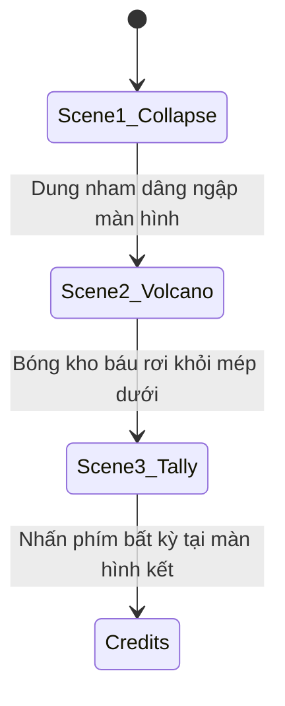

# Kế Hoạch Logic & Mô Tả Chi Tiết: Màn Hình Kết Thúc Spelunky (Không phụ thuộc Code)

Tài liệu này cung cấp hai phần: 
1. **Prompt Mô Tả Chi Tiết:** Dùng để đưa cho AI mô tả lại chính xác từng chuyển động, âm thanh và dòng chữ xuất hiện trong màn hình kết thúc.
2. **Kịch Bản Logic & Các Trạng Thái (Plan):** Phân tích các bước chuyển cảnh, điều kiện chuyển đổi trạng thái của nhân vật, camera và giao diện mà không nhắc tới code của bất kỳ ngôn ngữ nào. Bạn có thể sử dụng bản này cho bất cứ cấu trúc code/engine nào bạn tự xây dựng.

---

## PHẦN 1: PROMPT MÔ TẢ CHI TIẾT DIỄN BIẾN MÀN KẾT THÚC

**Yêu cầu:** Hãy tái hiện lại toàn bộ màn hình kết thúc (Endings) của Spelunky Classic theo 3 phân cảnh chi tiết như sau:

### Phân cảnh 1: Đền Thờ Sụp Đổ (Temple Collapse)
*   **Bối cảnh:** Lối ra sâu trong đền thờ cổ kính đổ nát, có các cột đá, dung nham đỏ rực ở phía dưới đáy, và một chiếc rương vàng khổng lồ đặt trên bệ đá cao ở góc phải.
*   **Diễn biến chính:**
    1.  Nhân vật tự động chạy từ bên trái màn hình sang bên phải. Camera lia chậm rãi theo hướng di chuyển của nhân vật. Nhạc nền game tắt hẳn, chỉ còn tiếng bước chân chạy rầm rập.
    2.  Nhân vật nhảy lên bệ đá và dừng lại sát chiếc rương vàng khổng lồ, quay mặt sang trái.
    3.  Chiếc rương vàng tự động bật nắp, một khối kho báu lớn (Idol vàng khổng lồ) bắn vút từ trong rương lên trên và rơi xuống đất ngay cạnh nhân vật.
    4.  Mặt đất bắt đầu rung lắc cực kỳ dữ dội. Các cột lửa và bụi dung nham đỏ rực bắn lên từ bên dưới.
    5.  Dung nham đỏ từ mép dưới màn hình dâng ngập lên rất nhanh, nuốt chửng toàn bộ đền thờ và che phủ toàn bộ màn hình thành màu đỏ/đen. Màn hình rung chuyển đến mức cực hạn trước khi tối sầm lại.

### Phân cảnh 2: Núi Lửa Phun Trào (Volcano Eruption)
*   **Bối cảnh:** Khung cảnh một ngọn núi lửa đang hoạt động sừng sững dưới bầu trời đêm sa mạc đầy sao lấp lánh.
*   **Diễn biến chính:**
    1.  Miệng núi lửa phun trào liên tiếp các tia lửa sáng chói bay lơ lửng xung quanh ngọn núi.
    2.  Một chiếc bóng đen của nhân vật (Player Silhouette) bị bắn vút ra khỏi miệng núi lửa theo một đường parabol (bay chếch lên trên về phía bên trái rồi rơi tự do xuống dưới).
    3.  Sau khi nhân vật bị bắn ra khoảng nửa giây, cái bóng đen của khối kho báu khổng lồ (Treasure Silhouette) cũng bị núi lửa phun mạnh ra ngoài, bay theo quỹ đạo parabol tương tự và rơi thẳng xuống mép dưới màn hình. Khi bóng kho báu rơi khuất màn hình, phân cảnh này kết thúc.

### Phân cảnh 3: Tiếp Đất & Tổng Kết Điểm Số (Score Tally)
*   **Bối cảnh:** Nền cát sa mạc phẳng lặng, bầu trời đêm tối.
*   **Diễn biến chính:**
    1.  Nhân vật rơi thẳng từ mép trên màn hình xuống đất cát sa mạc, đập phịch xuống tạo ra hai luồng khói bụi nhỏ văng sang hai bên, kèm tiếng động đập đất mạnh. Nhân vật nằm sấp bất động (bị choáng) một lát.
    2.  Khối kho báu lớn cũng rơi từ trên trời xuống nền cát ngay bên cạnh nhân vật. Khối kho báu va chạm với nền đất cát, nảy nhẹ lên một vài nhịp rồi nằm im, tạo ra bụi khói và tiếng động trầm đục.
    3.  Nhân vật gượng đứng dậy. Khi thấy hòm kho báu đã nằm im bên cạnh mình, nhân vật bắt đầu nhảy cẫng lên ăn mừng vui sướng liên tục. Nhạc chiến thắng (Victory Theme) hào hùng vang lên.
    4.  **Hiệu ứng mưa tiền:** Các đồng tiền vàng và ngọc ngọc ruby, sapphire, emerald... rơi liên tục như mưa từ đỉnh màn hình xuống dưới chân nhân vật.
    5.  **Chữ hiển thị lần lượt:**
        *   Dòng chữ lớn màu vàng **"YOU MADE IT!"** hiện lên trên cùng.
        *   Dòng chữ nhỏ màu vàng **"FINAL SCORE:"** hiện lên.
        *   Số tiền tích lũy bắt đầu nhảy số tăng dần cực nhanh từ 0 cho đến khi bằng tổng số tiền người chơi thu thập được thực tế (ví dụ: `$150,000`).
        *   Dòng chữ **"TIME: [phút:giây]"** hiện lên.
        *   Dòng chữ **"KILLS: [số lượng]"** hiện lên.
        *   Dòng chữ **"SAVES: [số lượng]"** hiện lên.
    6.  **Kết thúc:** Màn hình từ từ mờ dần thành màu đen (Fade Out). Giữa màn hình tối xuất hiện một thông điệp cuối cùng: **"YOU SHALL BE REMEMBERED AS A HERO."** Người chơi bấm nút bất kỳ để chuyển tới phần chạy chữ giới thiệu (Credits).

---

## PHẦN 2: BẢN KẾ HOẠCH LOGIC & CÁC TRẠNG THÁI (CODE-AGNOSTIC PLAN)

Để xây dựng màn chơi này trên hệ thống code riêng của bạn, bạn cần thiết kế dòng chảy logic dựa trên các Trạng Thái (States) và Điều Kiện Chuyển Đổi (Transitions) sau:

### 1. Phân Cảnh 1 (Scene 1): Logic Đền Thờ Sụp Đổ
*   **Trạng thái Camera:**
    *   Lia camera theo trục X từ vị trí bắt đầu sang phải với vận tốc không đổi cho đến khi đạt điểm giới hạn chứa bục rương.
    *   **Hiệu ứng Rung (Screen Shake):** Khi kích hoạt sụp đổ, mỗi khung hình ngẫu nhiên dịch chuyển tọa độ Y của Camera đi một khoảng từ `[1, 8]` pixel, rồi trả về `0` ở khung hình tiếp theo để tạo độ giật.
*   **Kịch bản Actor (Nhân vật đóng thế):**
    *   Vận tốc X > 0 (di chuyển liên tục sang phải). Hoạt ảnh: `Run`.
    *   Khi tọa độ X đạt điểm giới hạn -> Dừng di chuyển (Vận tốc X = 0). Hoạt ảnh: Quay mặt sang trái, chuyển sang trạng thái đứng yên (`Stand`).
*   **Kịch bản Rương & Kho báu:**
    *   Sau một khoảng trễ ngắn từ lúc Actor dừng -> Thay đổi trạng thái hiển thị của rương thành "Mở".
    *   Tạo thực thể Kho báu lớn tại vị trí rương, cho nó một lực đẩy hướng lên trên và hơi lệch trái (Vận tốc Y âm, Vận tốc X âm). Áp dụng trọng lực để nó rơi xuống nền đất của bệ đá và nằm im.
*   **Kịch bản Dung nham dâng:**
    *   Sau khi kho báu rơi xuống đất, tăng mạnh biên độ Rung màn hình.
    *   Tạo ra các thực thể lửa bốc lên ngẫu nhiên trên bệ đất.
    *   Tăng tọa độ Y của dung nham từ đáy màn hình đi lên.
    *   *Điều kiện chuyển Scene:* Khi dung nham bao phủ hoàn toàn tọa độ hiển thị của camera -> Tải Scene 2.

### 2. Phân Cảnh 2 (Scene 2): Logic Núi Lửa Phun Trào
*   **Kịch bản Núi lửa:**
    *   Mỗi chu kỳ thời gian (ví dụ 10-20 khung hình), tạo ra các hạt hiệu ứng lửa từ đỉnh núi bay ra xung quanh với vận tốc và hướng ngẫu nhiên để mô tả sự phun trào.
*   **Bóng Nhân Vật (Player Silhouette):**
    *   Sinh ra tại vị trí miệng núi lửa.
    *   Gán vận tốc ban đầu: Vận tốc X âm (bay sang trái), Vận tốc Y âm (bay ngược lên trời).
    *   Mỗi khung hình cộng thêm gia tốc trọng lực vào Vận tốc Y để tạo chuyển động rơi tự do.
*   **Bóng Kho Báu (Treasure Silhouette):**
    *   Sau một khoảng trễ (delay) từ lúc bóng nhân vật xuất hiện -> Sinh ra tại vị trí miệng núi lửa.
    *   Gán quỹ đạo bay và chịu trọng lực tương tự bóng nhân vật.
    *   *Điều kiện chuyển Scene:* Khi tọa độ Y của bóng kho báu vượt quá chiều cao màn hình (rơi xuống vực) -> Tải Scene 3.

### 3. Phân Cảnh 3 (Scene 3): Logic Tiếp Đất & Bảng Điểm
*   **Kịch bản Nhân vật (Actor 2):**
    *   *Trạng thái 1 (Rơi):* Rơi tự do từ trên cao xuống nền đất cát.
        *   Khi va chạm với đất cát (kiểm tra va chạm đáy): Vận tốc rơi = 0. Tạo hạt khói bụi văng sang hai bên trái phải. Phát âm thanh rơi. Chuyển sang *Trạng thái 2*.
    *   *Trạng thái 2 (Bị choáng):* Giữ nguyên hoạt ảnh nằm sấp trong khoảng thời gian trễ cố định. Hết thời gian -> Chuyển sang *Trạng thái 3*.
    *   *Trạng thái 3 (Chờ đợi):* Đứng dậy, quay mặt hướng về nơi kho báu sẽ rơi xuống.
    *   *Trạng thái 4 (Ăn mừng):* Khi Kho báu hoàn tất va chạm và đứng im -> Chuyển hoạt ảnh nhân vật sang trạng thái nhảy lên nhảy xuống liên tục.
*   **Kịch bản Kho Báu Lớn:**
    *   Bắt đầu rơi từ đỉnh màn hình xuống sau khi nhân vật nằm sân sa mạc.
    *   Khi va chạm đất cát:
        *   Nếu vận tốc rơi lớn hơn mốc tối thiểu: Đảo ngược vận tốc Y và nhân với hệ số phản xạ (ví dụ `-vận_tốc_Y * 0.5`) để tạo độ nảy. Tạo hạt bụi nhỏ và phát âm thanh đập đất trầm.
        *   Nếu vận tốc nảy quá nhỏ -> Triệt tiêu hoàn toàn vận tốc Y, đặt trạng thái nằm im trên cát.
*   **Máy Trạng Thái Giao Diện (UI State Machine):**
    *   Dùng một biến đếm trạng thái (`drawStatus` từ 0 đến 8) tăng dần theo thời gian trễ:
        *   `drawStatus = 1`: Vẽ dòng chữ "YOU MADE IT!". Kích hoạt nhạc chiến thắng.
        *   `drawStatus = 2`: Vẽ dòng chữ "FINAL SCORE:".
        *   `drawStatus = 3`: Bắt đầu đếm tiền. Tiền hiển thị tăng dần theo công thức nội suy (Lerp) tiến về số tiền thật của người chơi. Sinh hạt vàng/đá quý rơi từ đỉnh màn hình.
        *   `drawStatus = 4`: Hiện thông số "TIME".
        *   `drawStatus = 5`: Hiện thông số "KILLS".
        *   `drawStatus = 7`: Bắt đầu tăng dần độ mờ (Alpha) của một hình chữ nhật đen bao phủ màn hình từ `0` đến `1.0`. Khi Alpha đạt `1.0` -> Chuyển sang trạng thái cuối.
        *   `drawStatus = 8`: Vẽ thông điệp vinh danh người anh hùng ở chính giữa màn hình đen. Lắng nghe phím bất kỳ từ người chơi để chuyển cảnh.
